# My House — Software Architecture Document

> **Standard :** arc42 (adapté)
> **Version :** 2.2
> **Statut :** Validé
> **Dernière mise à jour :** Août 2026

---

## Table des Matières

1. [Introduction et Objectifs](#1-introduction-et-objectifs)
2. [Contraintes](#2-contraintes)
3. [Contexte et Périmètre](#3-contexte-et-périmètre)
4. [Stratégie de Solution](#4-stratégie-de-solution)
5. [Vue des Blocs Fonctionnels](#5-vue-des-blocs-fonctionnels)
6. [Vue Runtime — Flux Critiques](#6-vue-runtime--flux-critiques)
7. [Vue Déploiement](#7-vue-déploiement)
8. [Concepts Transverses](#8-concepts-transverses)
9. [Décisions d&#39;Architecture](#9-décisions-darchitecture)
10. [Exigences de Qualité](#10-exigences-de-qualité)
11. [Risques et Dette Technique](#11-risques-et-dette-technique)
12. [Glossaire](#12-glossaire)

---

## 1. Introduction et Objectifs

### 1.1 Objectif du Système

**My House** est une plateforme web de mise en relation entre propriétaires immobiliers et personnes en recherche de logement (maisons, studios, appartements, chambres). Elle couvre le cycle complet : publication de biens → recherche → prise de contact.

### 1.2 Objectifs de Qualité

| Priorité | Objectif                  | Motivation                                                                                  |
| --------- | ------------------------- | ------------------------------------------------------------------------------------------- |
| 1         | **Fiabilité**      | Les annonces publiées doivent être disponibles en permanence — c'est le cœur du service |
| 2         | **Sécurité**      | Authentification sans mot de passe, protection des données de contact des propriétaires   |
| 3         | **Maintenabilité** | Codebase évolutif du MVP vers V2 sans refactoring majeur                                   |
| 4         | **Performance**     | Recherche < 500ms, chargement feed < 2s                                                     |
| 5         | **Utilisabilité**  | Parcours minimal pour publier un bien et pour contacter un propriétaire                    |

### 1.3 Parties Prenantes

| Partie Prenante                     | Rôle              | Intérêt Principal                                         |
| ----------------------------------- | ------------------ | ----------------------------------------------------------- |
| **Owner** (Propriétaire)     | Utilisateur final  | Publier et gérer ses biens, être contacté                |
| **Seeker** (Visiteur/Chercheur) | Utilisateur final  | Trouver un logement, contacter un propriétaire             |
| **Admin**                     | Opérateur interne | Modérer la plateforme, valider les demandes propriétaires |
| **Équipe de développement** | Constructeur       | Architecture claire, dette technique maîtrisée            |

---

## 2. Contraintes

### 2.1 Contraintes Techniques

| Contrainte                         | Détail                                                                                   |
| ---------------------------------- | ----------------------------------------------------------------------------------------- |
| Backend en Rust                    | Décision non négociable — stack imposée                                               |
| Base de données relationnelle     | Les données (biens, utilisateurs, médias) sont fortement structurées et relationnelles |
| Authentification sans mot de passe | OTP par email uniquement au MVP — pas d'OAuth                                            |
| Stockage fichiers (MVP)            | Filesystem local via volume Docker. Abstraction `StorageProvider` obligatoire pour migrer vers un stockage S3-compatible (V2) sans modifier le code métier |
| Pas de Redis au MVP                | Cache in-memory uniquement (moka)                                                         |
| Environnement local conteneurisé  | Docker obligatoire pour garantir la parité dev/prod                                      |

### 2.2 Contraintes Organisationnelles

| Contrainte         | Détail                                                                          |
| ------------------ | -------------------------------------------------------------------------------- |
| MVP d'abord        | Aucune feature V2 (messagerie, carte, push, favoris) dans le périmètre initial |
| Conformité RGPD   | Différée à la phase pré-production — non bloquante pour le MVP              |
| Application mobile | Différée à V2 — web uniquement au MVP                                        |

---

## 3. Contexte et Périmètre

### 3.1 Contexte Métier

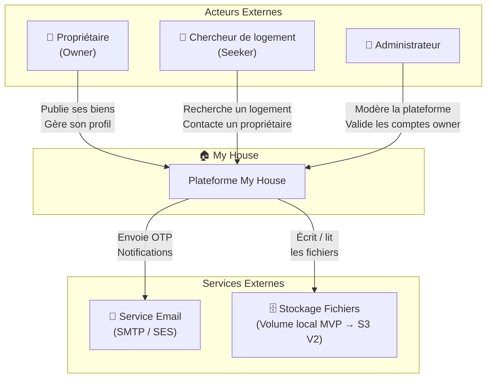

### 3.2 Contexte Technique

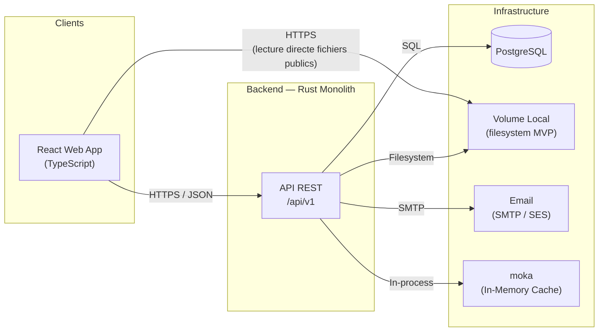

**Note :** le frontend lit les fichiers publics (photos de listings, avatars) directement depuis le volume servi en statique — le backend n'intervient pas dans cette lecture (cf. §7.3). L'écriture (upload) et les documents d'identité sensibles passent exclusivement par l'API.

**Interfaces externes du système :**

| Interface                 | Protocole         | Direction      | Usage                                |
| ------------------------- | ----------------- | -------------- | ------------------------------------ |
| React Frontend → Backend | HTTPS / REST JSON | Bidirectionnel | Toutes les interactions utilisateur  |
| Backend → PostgreSQL     | TCP / SQL (sqlx)  | Sortant        | Persistence des données             |
| Backend → Object Storage | Filesystem (MVP) / S3 API (V2) | Sortant        | Écriture des médias — abstraction `StorageProvider` |
| Frontend → Object Storage | HTTPS (statique)  | Sortant        | Lecture directe des fichiers publics (sans passer par le backend) |
| Backend → Email          | SMTP / SES API    | Sortant        | OTP, notifications transactionnelles |
| Backend → moka           | In-process        | Interne        | Cache OTP et sessions temporaires    |

---

## 4. Stratégie de Solution

### 4.1 Pattern Architectural Central : Modular Monolith

Un seul binaire déployé, structuré en modules de domaine aux frontières strictes. Chaque module encapsule sa propre logique métier, ses accès données et ses interfaces HTTP.

**Justification :**

- Cible 10K–100K utilisateurs : bien dans la zone de confort d'un monolithe optimisé
- Équipe réduite : pas d'overhead opérationnel microservices
- Rust enforce les frontières inter-modules à compile-time
- Extraction future en services indépendants possible sans refactoring majeur — les interfaces de domaine sont déjà propres

### 4.2 Layering Interne

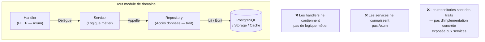

### 4.3 Stack Technique

| Couche                | Technologie                  | Justification                                          |
| --------------------- | ---------------------------- | ------------------------------------------------------ |
| Backend               | Rust / Axum / Tokio          | Async-first, sécurité mémoire, performances natives |
| Frontend              | React / TypeScript           | Productivité, typage fort, web-first MVP              |
| Base de données      | PostgreSQL                   | ACID, full-text search natif (tsvector), relationnel   |
| Cache                 | moka (in-memory)             | OTP éphémère sans dépendance Redis                 |
| Stockage médias      | Filesystem local (MVP) → MinIO/S3 (V2) | Abstraction trait `StorageProvider`, migration sans refactoring du code métier |
| Génération types TS | utoipa → openapi-typescript | Contrat API unique source de vérité                  |
| Conteneurisation      | Docker / docker-compose      | Parité dev/prod, onboarding simplifié                |

---

## 5. Vue des Blocs Fonctionnels

### 5.1 Niveau 1 — Vue Système

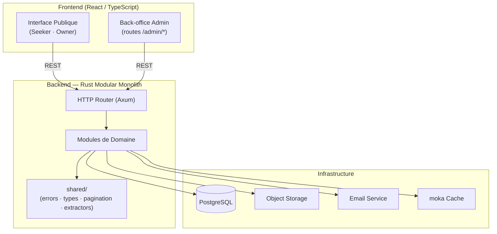

### 5.2 Niveau 2 — Modules de Domaine

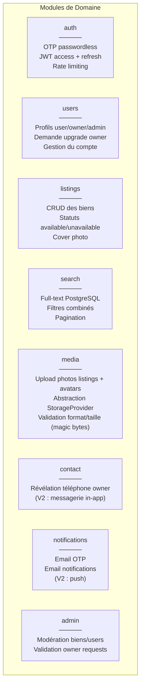

### 5.3 Dépendances Inter-Modules

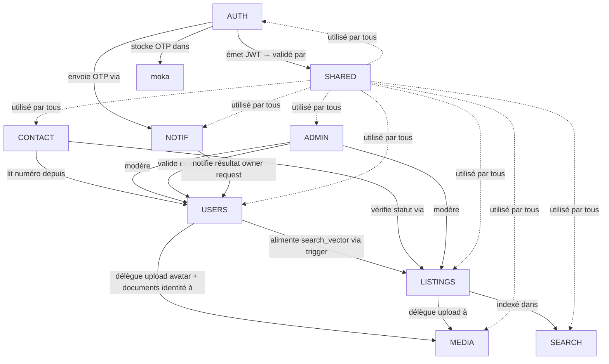

**Règle de dépendance :** les modules interagissent uniquement via des traits de service définis dans `shared/` ou via injection au bootstrap. Aucun module n'importe jamais l'implémentation concrète d'un autre.

---

## 6. Vue Runtime — Flux Critiques

### 6.1 Authentification OTP — Login et Inscription Unifiés

Le même endpoint gère login et inscription : si l'email est inconnu, le compte est créé après vérification du code. Le frontend est informé via `is_new_user: bool`.

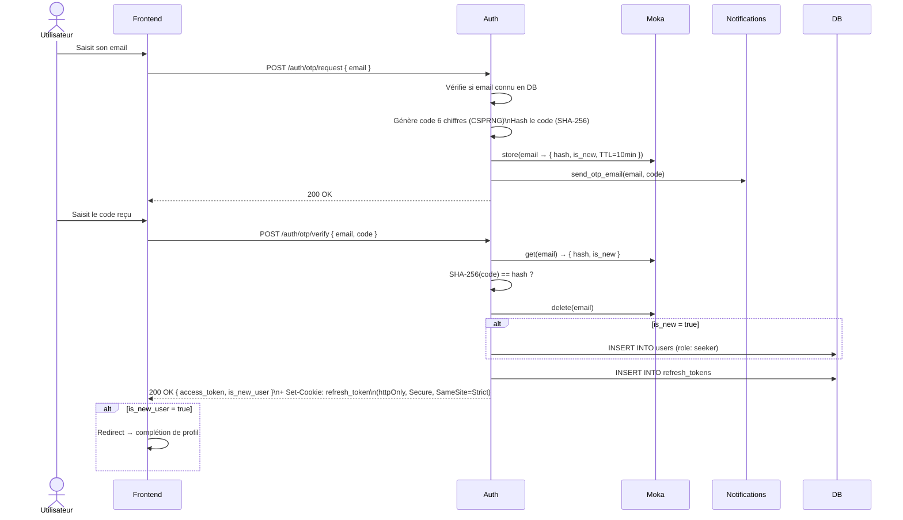

### 6.2 Demande et Validation du Rôle Owner

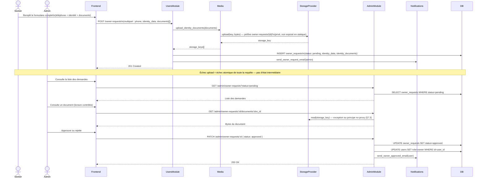

**Note — Admin unique au MVP :** un seul compte `admin` existe au MVP, créé par un script de bootstrap au démarrage (pas de self-service, pas d'endpoint de création d'admin). Ce compte unique traite l'intégralité de la modération (biens, utilisateurs, demandes owner) depuis le back-office. Le modèle V2 introduira un rôle **superviseur** intermédiaire, notamment pour distribuer la charge de validation des demandes owner entre plusieurs opérateurs — hors périmètre MVP (cf. §11, R-09).

**Note — Rappel mensuel de disponibilité (LIST-03 du cahier des charges) :** le CDC prévoit qu'un owner dont un bien reste marqué `available` sans mise à jour depuis un mois reçoive un rappel automatique. Ce mécanisme est **différé en V2** : il nécessite soit une tâche planifiée in-process (`tokio::time::interval`), soit un déclencheur externe (cron), et un suivi de dernière notification par listing — aucune de ces briques n'existe au MVP. Documenté comme dette produit/technique en §11 (R-10).

### 6.3 Core Loop — Publication et Découverte d'un Bien

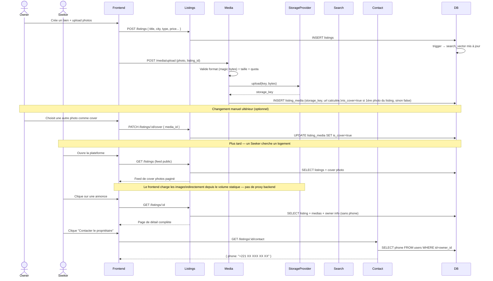

---

## 7. Vue Déploiement

### 7.1 Environnement Local (Développement)

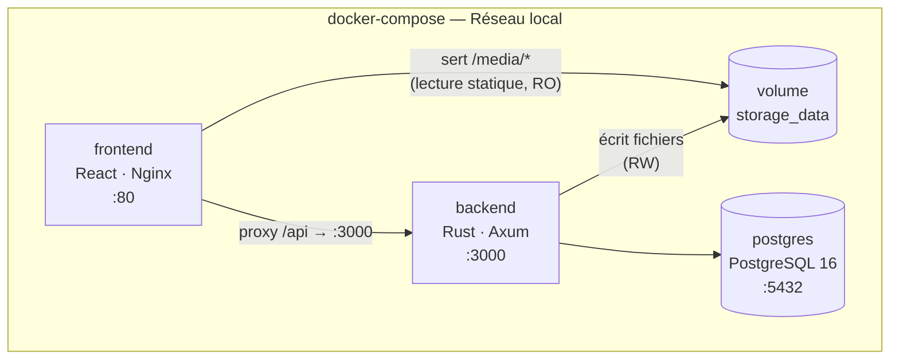

**Healthchecks :** postgres expose un healthcheck Docker natif. Le backend expose son propre endpoint `GET /health` (vérifie la connectivité PostgreSQL) utilisé comme healthcheck Docker. Le frontend ne démarre qu'après la disponibilité confirmée du backend.

### 7.2 Environnement Production (Cible)

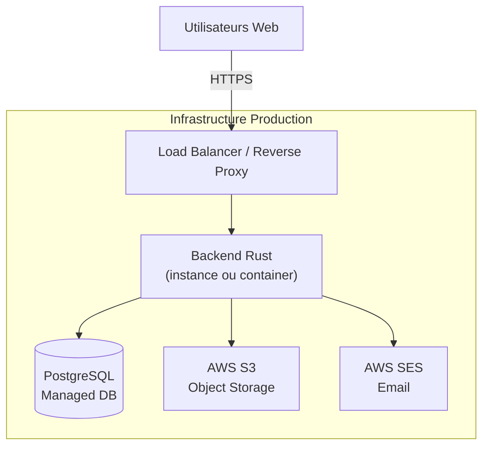

> Le détail de l'infrastructure production (cloud provider, orchestration, CI/CD) est hors périmètre de ce document — défini dans un document Infrastructure dédié.

> **Note MVP :** ce diagramme représente la cible V2. Si une mise en production a lieu avant la migration S3, le filesystem local (volume persistant monté sur l'instance backend) reste utilisable sans changement de code métier — seule la variable `STORAGE_PROVIDER` change au moment de la migration (cf. §7.3).

### 7.3 Abstraction Storage — Portabilité Dev/Prod

Le module `media` interagit uniquement avec le trait `StorageProvider`. L'implémentation concrète est sélectionnée au démarrage via variable d'environnement :

```
STORAGE_PROVIDER=local  →  LocalFsStorage  (MVP — dev et prod)
STORAGE_PROVIDER=s3     →  AwsS3Storage    (V2 — non implémenté au MVP, trait déjà compatible)
```

Aucun code métier n'est modifié lors de la migration V2 — seule l'implémentation concrète change.

**Principe — le backend ne proxie jamais la lecture des fichiers publics :** le frontend récupère les photos de listings et les avatars directement depuis l'URL stockée en base, servie en statique par nginx depuis le volume `storage_data` (jamais via un endpoint backend qui relit et retransmet les bytes). Ce principe élimine une charge inutile sur le backend et reste valable après la migration V2 (S3/CDN servent alors directement les URLs publiques).

`presigned_url` reste défini dans le trait `StorageProvider` pour garantir la compatibilité d'interface lors de la migration V2 (S3 imposera des URLs temporaires pour certains usages). Non implémenté pour `LocalFsStorage` au MVP — ce schéma de stockage n'a pas besoin d'URLs signées puisque les fichiers publics sont servis en statique sans contrôle d'accès.

**Exception documentée — documents d'identité (`owner_requests`) :** contrairement aux photos publiques, les documents d'identité soumis lors d'une demande owner sont des données sensibles à accès restreint (admin uniquement). Ils sont stockés sous un préfixe dédié (`owner-requests/{request_id}/`) **non exposé** par la configuration statique nginx. Leur lecture passe donc obligatoirement par un endpoint backend authentifié et contrôlé par rôle (`GET /admin/owner-requests/:id/documents/:doc_id`), qui appelle `StorageProvider::read()` après vérification d'autorisation. C'est la seule exception au principe no-proxy ci-dessus, justifiée par un besoin de contrôle d'accès qu'un serveur de fichiers statique ne peut pas assurer.

---

## 8. Concepts Transverses

### 8.1 Authentification et Autorisation

| Concept       | Détail                                                                                         |
| ------------- | ----------------------------------------------------------------------------------------------- |
| Mécanisme    | OTP Passwordless — email uniquement                                                            |
| Tokens        | JWT access token (15 min) + refresh token (fenêtre glissante 30 jours, rotation à chaque usage) |
| Refresh token — transport | Cookie `httpOnly`, `Secure`, `SameSite=Strict` — jamais exposé en JSON au frontend |
| Refresh token — rotation | Chaque appel `/auth/refresh` révoque l'ancien token et en émet un nouveau. Réutilisation d'un token déjà consommé = signal de vol → révocation de toute la famille de tokens liés |
| OTP           | Code 6 chiffres, CSPRNG, hashé SHA-256, stocké dans moka (TTL 10 min, usage unique)           |
| Rate limiting | 1 demande OTP / 60s par email, 3 tentatives max par code                                        |
| Autorisation  | Rôles portés dans le JWT claims — vérifiés par extracteur Axum sur chaque route protégée |
| Compte actif  | `is_active` revérifié en base par l'extracteur `AuthUser` sur **chaque** requête authentifiée (pas seulement au login) — une suspension admin prend effet immédiatement, y compris sur une session déjà active |
| Compte admin  | **Un seul compte `admin` au MVP**, créé par un script de bootstrap (variables d'environnement ou commande CLI dédiée) au déploiement initial — aucune route d'auto-inscription ou de promotion vers `admin` n'existe. Le rôle `admin` n'est jamais atteignable via `POST /owner-requests` ni via aucun endpoint utilisateur |

**Modèle de rôles et transitions :**

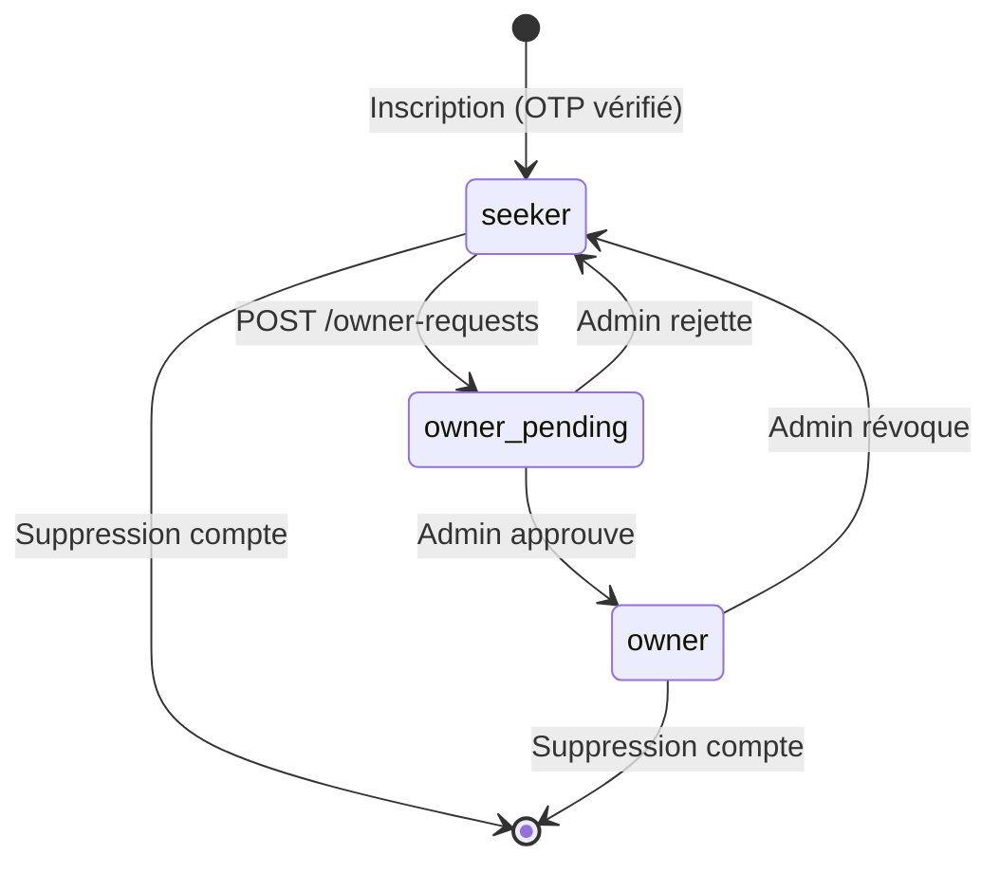

**Suppression de compte :** la cascade SQL (`ON DELETE CASCADE`) supprime les lignes liées (listings, listing_media, owner_requests, refresh_tokens), mais ne touche jamais le storage physique. Le nettoyage des fichiers (photos de listings, avatar, documents d'identité) est effectué applicativement — `StorageProvider::delete()` appelé pour chaque media avant l'exécution du `DELETE` SQL — pour éviter toute accumulation de fichiers orphelins.

### 8.2 Gestion des Erreurs

Toutes les erreurs convergent vers un type `AppError` centralisé, converti en réponse HTTP structurée uniforme :

```json
{
  "error": {
    "code": "LISTING_NOT_FOUND",
    "message": "Le bien demandé n'existe pas.",
    "status": 404
  }
}
```

### 8.3 Pagination

Standard appliqué sur tous les endpoints de liste :

```json
{
  "data": [...],
  "pagination": {
    "page": 1,
    "per_page": 30,
    "total": 143,
    "total_pages": 8
  }
}
```

### 8.4 Logging

Structured logging via `tracing` (écosystème Tokio). Format JSON en production, format lisible en développement. Niveau configurable via `RUST_LOG`.

### 8.5 Configuration

Variables d'environnement exclusivement — 12-factor app. Chargées au démarrage dans une struct `AppConfig` validée. Aucun fichier de configuration en production.

### 8.6 Génération des Types TypeScript

```
Backend (utoipa) → /api/docs/openapi.json → openapi-typescript → src/shared/api/types.ts
```

Le schéma OpenAPI est la source de vérité unique du contrat API. Les types TypeScript sont générés, jamais écrits manuellement.

### 8.7 Health Check et Arrêt Propre (Graceful Shutdown)

| Concept | Détail |
| --- | --- |
| `GET /health` | Endpoint non-authentifié, hors `/api/v1`. Vérifie la connectivité PostgreSQL (`SELECT 1`). Retourne `200` si prêt, `503` sinon. Utilisé comme healthcheck Docker et comme readiness probe pour un futur orchestrateur. |
| Graceful shutdown | Le serveur Axum intercepte `SIGTERM` (`with_graceful_shutdown`) : arrête d'accepter de nouvelles connexions, laisse les requêtes en vol se terminer, puis quitte. Évite les requêtes coupées lors d'un redéploiement. |

---

## 9. Décisions d'Architecture

| ID     | Décision                             | Alternatives écartées            | Raison                                                                              |
| ------ | ------------------------------------- | ---------------------------------- | ----------------------------------------------------------------------------------- |
| ADR-01 | **Modular Monolith**            | Microservices                      | Overhead non justifié à l'échelle cible (< 100K users)                           |
| ADR-02 | **OTP Passwordless**            | Email + password, OAuth            | Simplifie l'auth, supprime la gestion des mots de passe, surface d'attaque réduite |
| ADR-03 | **PostgreSQL full-text**        | Meilisearch, Elasticsearch         | Suffisant pour le MVP, pas de dépendance externe supplémentaire                   |
| ADR-04 | **moka (in-memory)**            | Redis                              | OTP est éphémère — Redis non justifié au MVP                                   |
| ADR-05 | **Trait StorageProvider + LocalFsStorage au MVP** | MinIO/S3 dès le MVP | Filesystem local (volume Docker) suffisant à l'échelle MVP, simplicité maximale ; le trait garantit la migration vers S3-compatible (V2) sans refactoring du code métier |
| ADR-06 | **utoipa + openapi-typescript** | Écriture manuelle des types TS    | Single source of truth — cohérence garantie entre backend et frontend             |
| ADR-07 | **Rôle `seeker` par défaut**  | Choix de rôle à l'inscription    | Friction minimale à l'entrée — upgrade owner en self-service validé par admin   |
| ADR-08 | **Un seul endpoint OTP**        | Endpoints login/register séparés | Simplifie le flux client —`is_new_user` gère le routage côté frontend         |
| ADR-09 | **Rotation du refresh token à chaque usage** | Refresh token statique valable 30 jours sans rotation | Détection de vol (réutilisation d'un token déjà consommé) et révocation immédiate de la famille de tokens ; le TTL 30 jours reste un plafond indépendant |
| ADR-10 | **Refresh token en cookie `httpOnly` + `SameSite=Strict`** | Refresh token retourné en JSON body | Protection contre le vol via XSS (non accessible en JS) ; `SameSite=Strict` neutralise le CSRF sans token dédié, suffisant pour un MVP mono-domaine |

---

## 10. Exigences de Qualité

### 10.1 Objectifs et Scénarios

| Qualité                  | Scénario                                    | Cible                                                  |
| ------------------------- | -------------------------------------------- | ------------------------------------------------------ |
| **Performance**     | Recherche full-text avec filtres             | < 500ms (P95)                                          |
| **Performance**     | Chargement du feed (20 items + cover photos) | < 2s                                                   |
| **Disponibilité**  | Uptime de la plateforme                      | 99.5%                                                  |
| **Sécurité**      | Tentatives de brute-force sur OTP            | Bloqué après 3 tentatives, délai 60s entre demandes |
| **Scalabilité**    | Passage de 10K à 100K utilisateurs          | Sans refactoring architectural                         |
| **Maintenabilité** | Ajout d'un nouveau module de domaine         | Sans modifier les modules existants                    |

### 10.2 Arbre de Qualité

```
Qualité Système
├── Fiabilité
│   ├── Disponibilité 99.5%
│   └── Cohérence des données (ACID PostgreSQL)
├── Sécurité
│   ├── Authentification OTP + JWT
│   ├── Protection données contact (phone révélé uniquement aux users connectés)
│   └── Rate limiting sur endpoints sensibles
├── Performance
│   ├── Search < 500ms (GIN index + tsvector)
│   └── Feed < 2s (cover photo + pagination)
├── Maintenabilité
│   ├── Frontières de modules respectées
│   ├── Tests unitaires par module
│   └── Contrat API typé (utoipa)
└── Évolutivité
    ├── Extraction microservice possible sans refactoring
    └── Swap Redis / moka via trait
```

---

## 11. Risques et Dette Technique

| ID   | Risque                                                                                  | Probabilité               | Impact                        | Mitigation                                                                     |
| ---- | --------------------------------------------------------------------------------------- | -------------------------- | ----------------------------- | ------------------------------------------------------------------------------ |
| R-01 | **moka non partageable** entre instances backend                                  | Faible (MVP mono-instance) | Élevé si scaling horizontal | Remplacer par Redis via le trait — changement localisé à `infra/cache.rs` |
| R-02 | **Full-text PostgreSQL insuffisant** pour recherche avancée (floue, multilingue) | Moyenne                    | Moyen                         | Extraction du module `search` vers Meilisearch via trait repository          |
| R-03 | **Délivrabilité email OTP** (spam, délai)                                      | Moyenne                    | Élevé                       | Utiliser un provider transactionnel fiable (SES, Postmark) dès la production  |
| R-04 | **Validation owner manuelle** non scalable                                        | Faible (MVP)               | Moyen                         | Back-office admin V2 avec workflow de validation automatisé                   |
| R-05 | **Charge pics sur le feed** (images lourdes)                                      | Faible                     | Moyen                         | CDN devant S3 en V2, lazy loading côté frontend dès le MVP                      |
| R-06 | **Storage filesystem non partagé** entre instances backend (volume local au conteneur) | Faible (MVP mono-instance) | Élevé si scaling horizontal | Migration vers S3-compatible via le trait `StorageProvider` — changement localisé à `infra/storage/`, déjà prévu en V2 |
| R-07 | **Absence d'index sur `listings.price`** alors que `price_min`/`price_max` sont des filtres actifs | Faible au volume MVP | Faible | Ajouter un index B-tree sur `price` si le volume de listings augmente significativement |
| R-08 | **Trigger `fn_update_listing_search_vector` exécute un `SELECT` sur `users` par ligne** modifiée — un changement de nom d'owner avec N listings déclenche N requêtes dans le trigger de cascade | Faible au volume MVP | Faible | Acceptable au MVP ; à revisiter (dénormalisation ou recalcul batch) si le volume de listings par owner augmente significativement |
| R-09 | **Un seul compte admin** — aucune redondance opérationnelle ; indisponibilité de l'admin bloque toute validation owner et toute modération | Faible (MVP, équipe réduite) | Moyen | Rôle superviseur (charge de validation distribuée) prévu en V2 |
| R-10 | **Rappel mensuel de disponibilité (LIST-03 du CDC) non implémenté au MVP** — exigence `Must` du cahier des charges différée faute de mécanisme de tâche planifiée | Certaine (déjà connu) | Faible produit / Moyen conformité contractuelle | Implémenter en V2 via tâche planifiée in-process ou cron externe ; amendement explicite du CDC en attendant (cf. CDC v2.1 §6.3) |

---

## 12. Glossaire

| Terme                      | Définition                                                                                                |
| -------------------------- | ---------------------------------------------------------------------------------------------------------- |
| **Owner**            | Utilisateur ayant obtenu le rôle propriétaire après validation admin. Peut publier des biens.           |
| **Seeker**           | Rôle par défaut à l'inscription. Peut naviguer, rechercher, et contacter un owner.                      |
| **Admin**            | Opérateur interne. Modère la plateforme et valide les demandes owner.                                    |
| **OTP**              | One-Time Password — code à 6 chiffres envoyé par email, valable 10 minutes, usage unique.               |
| **Listing**          | Annonce immobilière publiée par un owner (bien, description, photos, localisation, prix).                |
| **Cover photo**      | Photo mise en avant d'un listing, affichée dans le feed public. Sélectionnée automatiquement à la première photo uploadée sur le listing ; modifiable ensuite par l'owner parmi les photos existantes (`PATCH /listings/:id/cover`). |
| **Feed**             | Page d'accueil présentant les annonces sous forme de grille de cover photos scrollable.                   |
| **StorageProvider**  | Trait Rust abstraisant le stockage fichiers — implémenté par `LocalFsStorage` (MVP) et `AwsS3Storage` (V2). |
| **LocalFsStorage**   | Implémentation `StorageProvider` au MVP — écrit sur un volume Docker local, servi en statique par nginx. |
| **moka**             | Bibliothèque Rust de cache in-memory avec support TTL natif. Utilisée pour les OTP.                      |
| **search_vector**    | Colonne PostgreSQL de type `tsvector` utilisée pour la recherche full-text sur les listings.            |
| **ADR**              | Architecture Decision Record — document court capturant une décision architecturale et sa justification. |
| **Modular Monolith** | Pattern architectural : un seul binaire déployé, structuré en modules aux frontières strictes.         |
